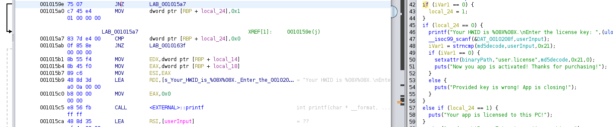
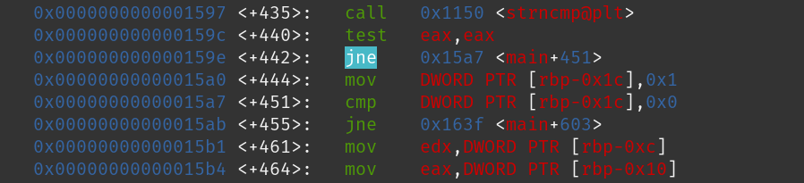
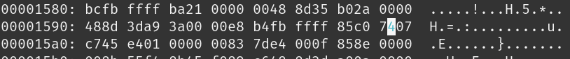

# LAB 2 

Decompiling the binary through Ghidra we find the following logic in the main function of the program

``` C++
undefined8 main(undefined8 param_1,undefined8 param_2)

{
  int iVar1;
  undefined8 in_R9;
  long in_FS_OFFSET;
  uint local_34;
  undefined4 local_30;
  undefined4 local_2c;
  uint local_28;
  int local_24;
  int local_20;
  undefined4 local_1c;
  uint local_18;
  uint local_14;
  long local_10;
  
  local_10 = *(long *)(in_FS_OFFSET + 0x28);
  local_1c = 1;
  local_34 = 3;
  local_30 = 0;
  local_2c = 0;
  local_28 = 0;
  local_18 = 0;
  local_14 = 0;
  local_24 = 0;
  __get_cpuid(1,&local_34,&local_30,&local_2c,&local_28,in_R9,param_2);
  local_18 = local_34 << 0x18 | local_34 >> 0x18 | (local_34 & 0xff00) << 8 | local_34 >> 8 & 0xff00;
  local_14 = local_28 << 0x18 | local_28 >> 0x18 | (local_28 & 0xff00) << 8 | local_28 >> 8 & 0xff00;
  snprintf(PSN,0x11,"%08X%08X",(ulong)local_18,(ulong)local_14);
  calc_md5(PSN,0x10);
  for (local_20 = 0; local_20 < 0x10; local_20 = local_20 + 1) {
    sprintf(md5decode + local_20 * 2,"%02x",(ulong)(byte)md5digest[0xf - local_20]);
  }
  readlink("/proc/self/exe",binaryPath,0x1000);
  getxattr(binaryPath,"user.license",xattrValue,0x1000);
  puts("Welcome to Lab2 super secure program!");
  iVar1 = strncmp(md5decode,xattrValue,0x21);
  if (iVar1 == 0) {
    local_24 = 1;
  }
  if (local_24 == 0) {
    printf("Your HWID is %08X%08X.\nEnter the license key: ",(ulong)local_18,(ulong)local_14);
    __isoc99_scanf(&DAT_0010208f,userInput);
    iVar1 = strncmp(md5decode,userInput,0x21);
    if (iVar1 == 0) {
      setxattr(binaryPath,"user.license",md5decode,0x21,0);
      puts("Now you app is activated! Thanks for purchasing!");
    }
    else {
      puts("Provided key is wrong! App is closing!");
    }
  }
  else if (local_24 == 1) {
    puts("Your app is licensed to this PC!");
  }
  system("read -p \'Press Enter to continue...\' var");
  if (local_10 != *(long *)(in_FS_OFFSET + 0x28)) {
                    /* WARNING: Subroutine does not return */
    __stack_chk_fail();
  }
  return 0;
}
```

## Keygen

By analyzing the main function, we can see MD5 mentioned in the code. MD5 is a hashing algorithm and it was clearly used to generate the key for out program 

```c++
snprintf(PSN,0x11,"%08X%08X",(ulong)local_18,(ulong)local_14);
calc_md5(PSN,0x10);
for (local_20 = 0; local_20 < 0x10; local_20 = local_20 + 1) {
    sprintf(md5decode + local_20 * 2,"%02x",(ulong)(byte)md5digest[0xf - local_20]);
}
```

we can clearly see that ```local_18``` and ```local_14``` represent the HWID

```c++
printf("Your HWID is %08X%08X.\nEnter the license key: ",(ulong)local_18,(ulong)local_14);
```

Concluding, MD5 was used to hash the HWID and then it was further convoluted.

## Patch

Analyzing the decompiled code we can clearly see a conditional that can be exploited
```c++
iVar1 = strncmp(md5decode,xattrValue,0x21);
    if (iVar1 == 0) {
    local_24 = 1;
}
```
here local_24 clearly represents a conditional for the presence of a license.



should be changed to 


Let's find the exact address of the conditional jump using GDB



Jump for __not equal__ is represented by __0x75__, whereas jump for __equal__ is __0x74__. We should change the byte as shown below

